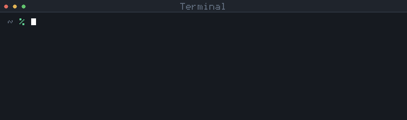
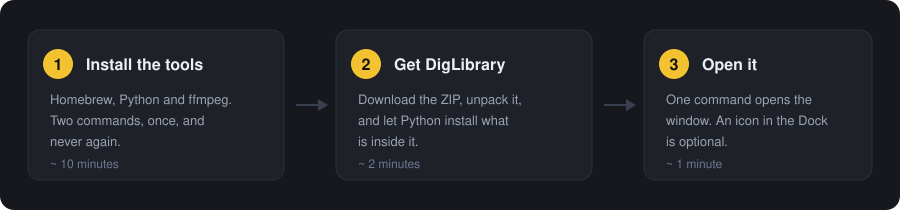
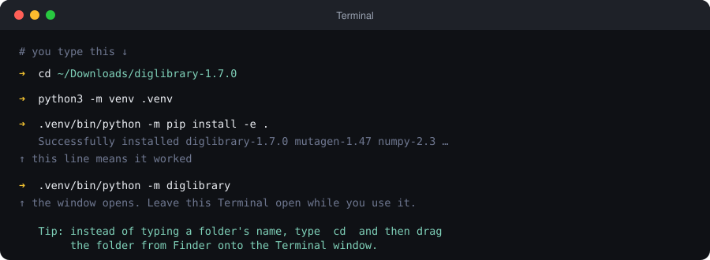
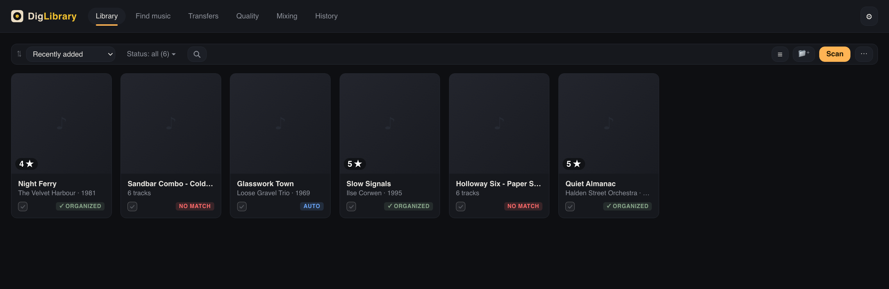
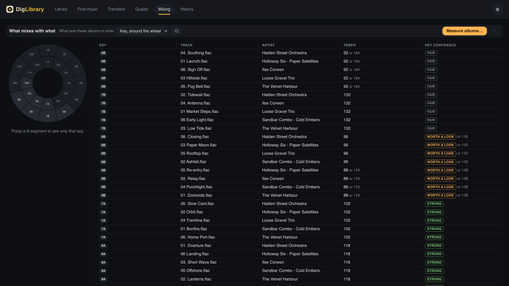

# DigLibrary

**In English: [README.md](README.md)** — the same content, step by step.

Um aplicativo de computador para o estado em que uma coleção de música
realmente está: **centenas de álbuns, vindos de cem lugares, cada um nomeado do
jeito que chegou.**

Ele lê as pastas que você apontar, descobre que álbum é cada um consultando o
Discogs e o MusicBrainz — e o próprio som, quando o nome não diz nada — e então
propõe **um plano para a leva inteira**: nomes de pasta, nomes de arquivo, tags
e capa. Você aprova, edita qualquer linha ou recusa. Nada é gravado até você
mandar, e tudo o que for gravado pode ser desfeito.

Ele também mede o áudio, então consegue dizer se um `.flac` é mesmo lossless —
que é a única coisa que o próprio arquivo nunca vai admitir.

**Organize primeiro, importe depois** — ou simplesmente mantenha a coleção em
ordem e em dia conforme ela cresce. O DigLibrary nunca abre a sua biblioteca do
Rekordbox nem a do Serato; ele trabalha nos arquivos, que é o que esses
programas leem.

Ele roda somente na sua máquina, sem necessidade de criar uma conta. Não existe
serviço nenhum por trás — sem telemetria, nada é contado sobre você — e nada sai
do seu computador além das consultas aos catálogos, que você vê acontecer, e das
buscas no Soulseek, se você usar esse serviço.

---

## O que ele faz

**Identifica álbuns.** Os nomes e as tags são lidos da pasta e comparados com o
Discogs e o MusicBrainz, com o iTunes como testemunha. Quando os nomes não
bastam, o próprio áudio ganha uma impressão digital, tirada com o Chromaprint e
consultada no AcoustID.

**Mede o que o áudio realmente é.** Um `.flac` convertido de um MP3 de 128 kbps
continua sendo um `.flac` para qualquer outra ferramenta. O DigLibrary
decodifica cada faixa, acha onde as frequências altas param e diz isso — no nome
da pasta, se você quiser, e num espectrograma que você mesmo pode olhar. Ele
também faz uma pergunta que o espectrograma não responde: **onde o áudio foi
cortado em quadros**. Um MP3 comprime numa grade fixa de 576 amostras, e
converter para FLAC copia essa grade junto com o som; testar os 576 alinhamentos
encontra a grade — o que alcança até um transcode de 320 kbps codificado sem
filtro low-pass, o arquivo que todo teste baseado no teto de frequência deixa
passar. O recurso `Analyze in depth` lê o arquivo inteiro, em catorze
frequências de medição, quando você decidir que vale a pena analisar um álbum a
fundo.

**Renomeia e grava as tags, de forma reversível.** Cada execução é um plano que
você lê antes de acontecer, mostrado como `agora → depois`, com todos os nomes
editáveis — e a sua palavra vale mais que a do catálogo, isto é, você pode fazer
pequenos ajustes à mão e isso é o que vale. Os arquivos são gravados numa cópia
e depois movidos para o lugar, então, mesmo que uma gravação seja interrompida
no meio do processo, nenhum arquivo é deixado pela metade.

**E a reversão é ensaiada antes de começar.** Toda execução aplicada fica no
History com um `Revert`, que percorre o desfazer inteiro primeiro e recusa tudo
se algum passo não puder ser dado. Ele também encontra o álbum mesmo que você o
mova de lugar, dentro das pastas que ele conhece.

**Encontra música,** opcionalmente, através da sua própria instância do
[slskd](https://github.com/slskd/slskd) na rede Soulseek. É o único provedor de
aquisição, e não faz nada até você apontá-lo para um slskd que você mesmo roda,
com uma chave de API. Os downloads são acompanhados em **Transfers**, e um álbum
entra na biblioteca quando todos os arquivos dele chegaram.

**Mede tom e andamento, e os dispõe na roda Camelot.** A tela Mixing mostra as
faixas que você pediu para medir. Ao lado de cada tom ela diz o quanto a leitura
foi decidida — e, quando dois tons chegaram quase empatados, ela nomeia o outro,
porque um empate entre vizinhos na roda não é uma resposta duvidosa: os dois
mixam do mesmo jeito.

**Dê a um disco uma nota de até cinco, na própria capa**, ordene e filtre a
estante por ela, e dê uma capa ao álbum quando o Cover Art Archive não tiver
nenhuma.

**Nunca inventa metadado.** Um álbum que ele não consegue identificar com
confiança fica intocado e vai para revisão, com o motivo. Ele nunca toca num
banco de dados do Rekordbox.

### As seis telas

| | |
|---|---|
| **Library** | A sua estante, em cartões ou em lista: identificar, planejar, aplicar, dar nota. |
| **Find music** | Buscar no Soulseek pelo seu próprio slskd e pedir o que você encontrar. |
| **Transfers** | O que está baixando, o que chegou inteiro e o que parou no meio. |
| **Quality** | A bancada: o que um arquivo é de verdade, com espectrograma e veredito. |
| **Mixing** | Tom, andamento e a roda Camelot sobre as faixas que você mediu. |
| **History** | Toda execução que gravou nos seus arquivos, cada uma com um `Revert`. |

---

## Requisitos

| O quê | Por quê | Como |
|---|---|---|
| **macOS 12 ou mais recente** | Windows e Linux ainda não são suportados — o painel de pastas, a chamada que mantém o Mac acordado durante os downloads e o pacote do aplicativo são do macOS. Há intenção de suportá-los, sem data; a instalação em qualquer um dos dois funciona, e depois o aplicativo se recusa a abrir, dizendo isso. **Se você quiser ser a razão de um deles chegar, abra uma issue e diga qual** | — |
| **Python 3.12 ou mais recente** | O aplicativo é escrito em Python | `brew install python`, ou o instalador do [python.org](https://www.python.org/downloads/) |
| **ffmpeg** | Mede o áudio e desenha os espectrogramas. Sem ele o aplicativo roda do mesmo jeito, e a tela Quality diz com todas as letras que não consegue medir | `brew install ffmpeg` |
| **chromaprint** *(opcional)* | Impressão digital do áudio, para identificar álbuns pelo som | `brew install chromaprint` |
| **[slskd](https://github.com/slskd/slskd)** *(opcional)* | Só para a tela Find music — downloads pelo Soulseek, que também exigem uma conta gratuita no Soulseek | A documentação do próprio slskd |

Se você não tem o Homebrew: [brew.sh](https://brew.sh).

---

## Primeiros passos

**Você não precisa saber programar.** Precisa, sim, digitar algumas linhas num
aplicativo chamado Terminal, que vem em todo Mac.

> **Para abrir o Terminal:** aperte `⌘ Espaço`, digite `terminal`, aperte Return
> (Enter). Aparece uma janela com texto dentro. A ferramenta inteira é isso.

São três linhas, e as duas primeiras se fazem uma vez só, nunca mais:

```bash
/bin/bash -c "$(curl -fsSL https://raw.githubusercontent.com/Homebrew/install/HEAD/install.sh)"
```

```bash
brew install python ffmpeg pipx && pipx ensurepath
```

```bash
pipx install diglibrary
```

Feche o Terminal e abra de novo — foi o `pipx ensurepath` da segunda linha que
pôs o `diglibrary` no seu caminho, e um Terminal que já estava aberto não ficou
sabendo disso. Depois, para abrir o aplicativo, digite:

```bash
diglibrary
```

É isso que o segundo comando mostra no Terminal — uma instalação de verdade,
feita a partir do índice de pacotes, na velocidade que ela levou:



**Deixe essa janela do Terminal aberta enquanto usa o aplicativo nesta primeira
vez** — ele está rodando dentro dela, então fechar a janela fecha o aplicativo.
Isso dura exatamente uma sessão: a caixa da próxima tela é o que acaba com isso.

**Na primeira vez que abre, ele se oferece para ir para a sua pasta
Aplicativos.** A caixa já vem marcada; deixe assim e aperte *Start using
DigLibrary*. Daí em diante o DigLibrary abre como qualquer outro aplicativo do
seu Mac — pela pasta Aplicativos ou pelo Launchpad — e você não precisa mais do
Terminal. Arraste-o para o Dock se quiser que ele fique lá.

Se você desmarcar a caixa e mudar de ideia, o botão está em **Settings**. Existe
também um comando, que é o mesmo gesto por outra porta:

```bash
diglibrary make-icon
```

Qualquer um dos três cria o `~/Applications/DigLibrary.app`. Ele é montado aqui,
no seu Mac, para esta instalação — não é algo que você possa mandar para alguém,
e em outra máquina não abriria nada.

Para atualizar depois: `pipx upgrade diglibrary`. Para remover por completo:
`pipx uninstall diglibrary`, e apague a pasta `~/.diglibrary`.

**A primeira linha é o Homebrew**, que é quem instala as outras duas coisas, e
ele vai pedir a senha do seu Mac — precisa dela para instalar, e é o seu próprio
Mac que está pedindo. Nada aqui pede senha para qualquer outra coisa. Pule essa
linha se você já tem o Homebrew: digite `brew --version` e veja se ele responde.

**O Homebrew termina imprimindo uma lista curta chamada `Next steps`, e aquelas
linhas fazem parte da primeira linha.** Rode cada uma delas, na ordem, antes de
digitar a segunda — são elas que põem o `brew` no seu caminho, e enquanto não
tiverem rodado, `brew install …` responde `command not found: brew`.

**O `ffmpeg` não é opcional do jeito que o resto é.** Ele não é um pacote
Python, então nada que o `pipx` faça consegue trazê-lo: sem ele o DigLibrary
roda do mesmo jeito e a tela Quality diz com todas as letras que não consegue
medir nada. Já o `chromaprint` é opcional de verdade, e vale a pena se você tem
álbuns cujos nomes não dizem nada:

```bash
brew install chromaprint
```

---

## Instalar a partir do código-fonte, passo a passo

**Você não precisa disto se as três linhas acima funcionaram.** É o mesmo
aplicativo, instalado a partir do código em vez de pelo nome — que é o que você
quer se pretende ler o código, alterá-lo ou rodar a suíte de testes.



Cada passo abaixo é uma linha: copie, cole, aperte Return (Enter) e espere
terminar. Uns quinze minutos no total, e os passos 1 e 2 se fazem uma vez só,
nunca mais.

### 1. Instalar o Homebrew

O Homebrew é quem instala as duas coisas de que o DigLibrary precisa. Pule este
passo se você já o tem (digite `brew --version` e veja se ele responde).

```bash
/bin/bash -c "$(curl -fsSL https://raw.githubusercontent.com/Homebrew/install/HEAD/install.sh)"
```

Ele vai pedir a senha do seu Mac — precisa dela para instalar, e é o seu próprio
Mac que está pedindo. Nada aqui pede senha para qualquer outra coisa.

Ao terminar, ele imprime uma lista **Next steps** com mais algumas linhas.
**Rode cada uma delas, na ordem.** São elas que põem o `brew` no seu caminho — a
última faz isso para a janela do Terminal que você já tem aberta, e as outras
para todas as janelas que você abrir depois. Quantas são depende do que o seu
Mac já tinha, então rode o que ele imprimiu em vez de contar.

### 2. Instalar o Python e o ffmpeg

```bash
brew install python ffmpeg
```

Opcional, e vale a pena se você tem álbuns cujos nomes não dizem nada:

```bash
brew install chromaprint
```

### 3. Baixar o DigLibrary e descompactar

Baixe o ZIP da
[versão mais recente](https://github.com/cankblunt/diglibrary/releases/latest) e
dê dois cliques nele. Você fica com uma pasta chamada algo como
`diglibrary-1.7.0`, normalmente em **Downloads**. Deixe-a lá ou mova para onde
você guarda as suas coisas — só lembre onde.

### 4. Apontar o Terminal para essa pasta

Digite `cd` e um espaço, depois **arraste a pasta do Finder para dentro da
janela do Terminal** — ele escreve o caminho por você — e aperte Return
(Enter).

```bash
cd ~/Downloads/diglibrary-1.7.0
```

### 5. Criar um lugar para ele morar

```bash
python3 -m venv .venv
```

Isso cria uma pasta chamada `.venv` ali dentro, para que as peças do DigLibrary
fiquem juntas e não encostem em mais nada do seu Mac. Nada é impresso. É normal.

### 6. Instalar

```bash
.venv/bin/python -m pip install -e .
```

Um minuto de texto rolando, terminando em `Successfully installed diglibrary-…`.
É por essa linha que você sabe que deu certo.

### 7. Abrir

```bash
.venv/bin/python -m diglibrary
```



A janela abre. **Deixe o Terminal aberto enquanto usa o aplicativo** — fechá-lo
fecha o DigLibrary. Daqui em diante, abrir o DigLibrary de novo são os passos 4
e 7: apontar o Terminal para a pasta e rodar aquela única linha.

### 8. Opcional: um ícone para abrir com dois cliques

```bash
.venv/bin/diglibrary make-icon
```

**Na primeira vez que você o abriu, no passo 7, ele se ofereceu para fazer isto
por você** — a caixa daquela tela e este comando são o mesmo gesto por duas
portas, e o botão em Settings também.

Isso cria o `~/Applications/DigLibrary.app`, que abre o aplicativo sem o
Terminal. Ele aponta para **esta** pasta em vez de ser uma cópia do programa,
então funciona só neste Mac e só enquanto a pasta continuar onde está. Não o
mande para ninguém — na máquina da outra pessoa ele não abre nada. Ela instala a
partir do código, do mesmo jeito que você acabou de fazer.

### O que você vê na primeira vez

Uma janela oferece os serviços opcionais e deixa você pular todos. Depois:
arraste uma pasta de álbuns para a janela, ou acrescente uma com o botão 📁+, e
aperte **Scan**. Nada é gravado nos seus arquivos até você ler um plano e
apertar `Approve & apply` — e tudo o que for gravado pode ser desfeito em
**History**.

**A Library**, onde ficam os seus discos. Na imagem abaixo as capas estão em
branco porque ela mostra uma biblioteca simulada, feita de álbuns inventados.



**Mixing**, para DJs: o tom e o andamento das faixas que você pediu para medir,
dispostos em volta da roda Camelot, cada tom com o quanto a leitura foi decidida
e — quando a disputa foi apertada — o tom que ficou em segundo.



### Quando algo dá errado

| O que aparece | O que significa |
|---|---|
| `command not found: brew` | O Homebrew está instalado, mas ainda não está no seu caminho. Rode cada linha da lista **Next steps** que ele imprimiu no final — todas, na ordem. |
| `command not found: python3` | O passo 2 não terminou, ou o Terminal já estava aberto antes dele. Feche o Terminal e abra de novo. |
| `no such file or directory` depois do `cd` | O Terminal não está na pasta certa. Refaça o passo 4 com o truque de arrastar. |
| A tela Quality diz que não consegue medir | Falta o `ffmpeg` — passo 2. |
| O macOS pede acesso às suas pastas **de novo** | Nada mudou no DigLibrary. O macOS concede acesso a pastas a um *binário*, e o `brew upgrade` substitui o Python sobre o qual o DigLibrary roda — para o macOS, um binário novo é um aplicativo novo, então ele pergunta mais uma vez. Conceder de novo é seguro, e ele para de perguntar. |
| Outra coisa | Abra uma [issue](https://github.com/cankblunt/diglibrary/issues) e cole o que o Terminal disse. |

---

## Onde o DigLibrary guarda as suas coisas

A primeira execução grava o `~/.diglibrary/config.toml` e mantém todo o resto ao
lado dele — o banco de dados, os logs, os caches e os backups. **Uma pasta para
fazer backup, uma pasta para apagar.** A sua música nunca é movida para lá; o
DigLibrary só grava dentro das pastas que você aponta, e só depois que você
aprova um plano.

## O que são todos esses arquivos

O download é o próprio código-fonte do programa, então a maior parte do que está
nele é para quem vai alterar o DigLibrary, não para quem vai usá-lo. **Você pode
ignorar tudo.**

| | |
|---|---|
| `README.md` / `LEIAME.md` | Esta página. Os dois únicos arquivos aqui escritos para você. |
| `CHANGELOG.md` | O que mudou em cada versão. |
| `src/` | O programa em si. |
| `tests/`, `tools/`, `docs/`, `benchmark/`, `packaging/` | Para quem trabalha no DigLibrary: a suíte de testes, os scripts, a documentação, o benchmark que sustenta os vereditos de qualidade e a fórmula do Homebrew. |
| `pyproject.toml`, `LICENSE` | Como o Python o instala, e a licença (MIT). |

**Por que `.md` e não `.txt` ou `.docx`?** Um arquivo `.md` *é* um arquivo de
texto puro — dê dois cliques e o TextEdit abre, sem precisar de nenhum programa
especial. A diferença é que o GitHub o exibe com títulos e tabelas, coisa que um
`.txt` não ganha; e, ao contrário de um `.docx`, ele não precisa do Word, não
pesa nada e pode ser lido em qualquer máquina que já foi feita.

Um `config.toml` na pasta de onde você roda o programa prevalece sobre aquele, e
tudo o que ele nomeia é resolvido ao lado *dele*. É assim que uma cópia de
trabalho do repositório mantém a sua própria instalação; não é assim que um
clone começa, porque este repositório não traz nenhum `config.toml` próprio.

Para ter um ícone no Dock:

```bash
.venv/bin/diglibrary make-icon
```

Isso cria o `~/Applications/DigLibrary.app`. É um pacote que aponta para a **sua
própria** cópia de trabalho, e não uma versão autossuficiente: ele abre o código
como está, então não há nada a refazer depois de uma edição — e, pela mesma
razão, não pode ser copiado para outra máquina, onde não abriria nada. Lá,
instale a partir do código.

### Duas portas locais, enquanto o aplicativo está aberto

As duas escutam em `127.0.0.1`, nenhuma é alcançável a partir da sua rede, e as
duas param junto com o aplicativo.

**A porta das capas.** Desenhar uma estante de capas exige uma URL para cada
uma, então o aplicativo serve imagens de capa à própria janela, e nada mais. Ele
só entrega capas de álbuns que estão na sua estante, nunca aceita um caminho — a
requisição nomeia um identificador opaco — e toda requisição carrega um token
gerado de novo a cada execução. Uma requisição sem o token recebe a mesma
resposta que uma requisição por algo que não existe, então a porta não serve
para perguntar se a sua biblioteca tem um determinado álbum.

**A porta da janela.** A interface é HTML, e o script dela é um módulo ES, que
um motor de navegador se recusa a carregar de um endereço `file://`. Por isso o
pywebview serve os quatro arquivos da própria janela. Essa pasta é tudo o que
ele serve.

### O que sai da sua máquina

Só o que é preciso para identificar um álbum ou para encontrar um, e só quando
você pede:

- **Nomes de álbum e de faixa, durações e algum código de barras** vão para o
  MusicBrainz e o iTunes, e para o Discogs quando ele está conectado, para
  descobrir qual edição você tem.
- **O identificador da edição** vai para o Cover Art Archive, para buscar a
  capa, a não ser que você tenha desligado a arte de capa.
- **Uma impressão digital acústica** — um resumo compacto do som, não o áudio —
  vai para o AcoustID, e só se você instalou o `chromaprint` e forneceu uma
  chave. O áudio em si nunca é enviado.
- **Um link do Spotify que você cola** vai para o Spotify, para ser lido como um
  artista e um álbum.
- **O que você busca em Find music** vai para o seu próprio slskd, e dele para a
  rede Soulseek.
- **Mais nada.** Sem telemetria, sem relatório de falhas, sem analytics, sem
  conta. A sua biblioteca nunca sai da máquina, e o banco de dados também não.

O log em `logs/diglibrary.jsonl` fica na sua máquina e registra o caminho
completo das pastas em que o aplicativo trabalhou, então leia-o antes de
anexá-lo a um relato de bug.

## Credenciais — nenhuma é obrigatória

**Ele funciona sem nada configurado.** Os álbuns são identificados no
MusicBrainz, as capas vêm do Cover Art Archive, o iTunes é consultado como
testemunha, e toda medição de áudio acontece na sua própria máquina. Na primeira
vez que você o abre, uma janela diz isso e oferece os serviços opcionais abaixo;
você pode pular e conectá-los depois, em Settings.

O DigLibrary **não traz nenhuma chave de API**. Um aplicativo de código aberto
não consegue guardar um segredo, então as chaves opcionais são criadas e
guardadas por você. Cole-as naquela janela e elas são gravadas em
`~/.diglibrary/env`, legível só por você — nunca no `config.toml`, nunca num
log, e nunca devolvidas à janela, que só fica sabendo *se* um serviço está
conectado.

| Serviço | O que acrescenta | Precisa? |
|---|---|---|
| **Discogs** | As correspondências melhoram muito, principalmente em catálogos de fora dos Estados Unidos e do Reino Unido, onde o Discogs muitas vezes é a única fonte que lista a prensagem que você realmente tem. [Crie um token](https://www.discogs.com/settings/developers). | Opcional, e o que mais vale a pena |
| **AcoustID** | Identifica um álbum pelo som do áudio quando os nomes não dizem nada de útil. Também precisa do `chromaprint`. [Registre um aplicativo](https://acoustid.org/new-application). | Opcional |
| **slskd** | A sua própria instância do slskd, para a tela Find music. Precisa do papel `readwrite`. | Só para downloads |
| **Spotify** | Permite colar um link de álbum do Spotify e buscar aquele disco pelo nome. O link é lido como *palavras* — um artista e um álbum — e nada do que ele devolve é guardado, posto em cache ou gravado em arquivo. [Crie um app](https://developer.spotify.com/dashboard). | Opcional |

Se você preferir não usar a janela, as mesmas variáveis de ambiente continuam
funcionando, e continuam prevalecendo sobre o que estiver guardado:

```bash
export DIGLIBRARY_DISCOGS_TOKEN="…"
export DIGLIBRARY_ACOUSTID_KEY="…"
export DIGLIBRARY_SLSKD_API_KEY="…"
export DIGLIBRARY_SPOTIFY_CLIENT_ID="…"
export DIGLIBRARY_SPOTIFY_CLIENT_SECRET="…"
# Só se você quiser o seu próprio endereço no seu tráfego com o MusicBrainz; o
# aplicativo já se identifica por padrão, que é o que o MusicBrainz pede.
export DIGLIBRARY_MUSICBRAINZ_CONTACT="you@example.com"
```

Um aplicativo aberto pelo ícone não herda o ambiente do shell, e é por isso que
o `~/.diglibrary/env` existe. O DigLibrary o lê a cada abertura, seja qual for o
jeito como você o iniciou, então uma chave colada na janela já vale na próxima
vez que você o abrir — pela pasta Aplicativos, por um terminal, por onde for. Um
nome que o seu próprio shell já exporta prevalece sobre o arquivo.

## Configuração

O `~/.diglibrary/config.toml` é seu para editar, e nada o reescreve. Os
comentários dele explicam cada ajuste; os que as pessoas mudam primeiro são o
estilo de nomes, se a arte de capa é buscada e os limites de cache. Os modelos
de nome também estão lá, caso nenhum dos seis estilos que vêm prontos seja o
jeito como você nomeia as coisas.

`--config /algum/outro.toml` roda sobre uma instalação completamente diferente.

## Cópias do seu banco de dados, e como restaurar uma

Uma cópia compactada do banco de dados é gravada sempre que a janela abre e algo
mudou, e antes de qualquer atualização do esquema. Cada uma é lida de volta
antes de ser aceita — aberta como banco de dados e descompactada para conferir a
soma de verificação —, então uma cópia que existe é uma cópia que funcionou.

Elas são o único registro da sua biblioteca fora do arquivo em uso, então aponte
`copies_directory` para algum lugar que **não** fique ao lado do banco de dados:

```toml
[database]
copies_directory = "~/Documents/DigLibrary-database-copies"
```

Para ver o que existe, e para restaurar uma:

```bash
.venv/bin/diglibrary restore-copy
```

Sem argumentos, ele lista as cópias. `--newest` restaura a mais recente; ou dê o
nome de um arquivo para escolher. Feche o DigLibrary antes. O banco de dados que
está sendo substituído é renomeado e posto de lado, não apagado, então desfazer
uma restauração é um único `mv`.

**Isto não é um backup.** Toda cópia mora no mesmo disco que o original.
Configure o Time Machine, ou copie essa pasta para outro lugar — um disco que
falha leva junto a biblioteca e o histórico dela.

---

## O que ele não faz

- **Não toca no seu banco de dados do Rekordbox.** Nunca, por decisão de
  projeto.
- **Não grava metadado do qual não tem certeza.** Sem uma correspondência
  confiável, os arquivos ficam exatamente como estavam, e o álbum entra na fila
  para a sua revisão.
- **Não exige um serviço de IA** em nenhum caminho essencial.
- **Não faz engenharia reversa de nada.** Toda integração é uma API oficial ou
  um protocolo documentado, e os termos publicados de cada uma foram lidos antes
  de ela ser escrita.

A arte de capa vem do [Cover Art Archive](https://musicbrainz.org/doc/Cover_Art_Archive/API).
Essas imagens são protegidas por direitos autorais, de quem os detém, e são
oferecidas para fins de arquivamento; o uso é por sua conta e risco. O
DigLibrary não hospeda cópia de nada e só grava nos seus próprios arquivos. As
imagens do Discogs nunca são baixadas nem embutidas — os termos dele não
permitem.

## Para quem contribui

```bash
.venv/bin/python -m pip install -e ".[dev]"
.venv/bin/python -m pytest        # a suíte tem de continuar verde
.venv/bin/python -m ruff check .
.venv/bin/python -m black --check .
```

Os limites da arquitetura são garantidos por testes, e não por convenção:
`tests/architecture/` lê o código-fonte pela árvore sintática e falha quando uma
camada atravessa um deles. O [CHANGELOG](CHANGELOG.md) diz o que cada versão
mudou para os arquivos no seu disco.

Como acrescentar um provedor ou uma fonte de metadados sem editar o núcleo:
[Extending DigLibrary](docs/EXTENDING.md).

**Existe um tap do Homebrew**, se você prefere instalar isto do jeito que instala
todo o resto — o `ffmpeg` vem junto e nenhum Terminal precisa ser reaberto:

```bash
brew trust --tap cankblunt/diglibrary
```

```bash
brew install cankblunt/diglibrary/diglibrary
```

Ele está aqui, e não em *Primeiros passos*, de propósito. O Homebrew agora pede
que você confie num tap de terceiros antes de carregá-lo, e **ele tem razão em
pedir** — é o Ruby de um desconhecido prestes a rodar na sua máquina. Quem está
instalando o primeiro aplicativo não deveria ter de responder a essa pergunta,
então o começo desta página dá o caminho que nunca a faz. Se você está lendo
esta seção, já sabe como decidir. A fórmula é escrita e revisada em
`packaging/homebrew/`, aqui; o repositório do tap é uma cópia desse único
arquivo.

## Licença

MIT — veja [LICENSE](LICENSE).
